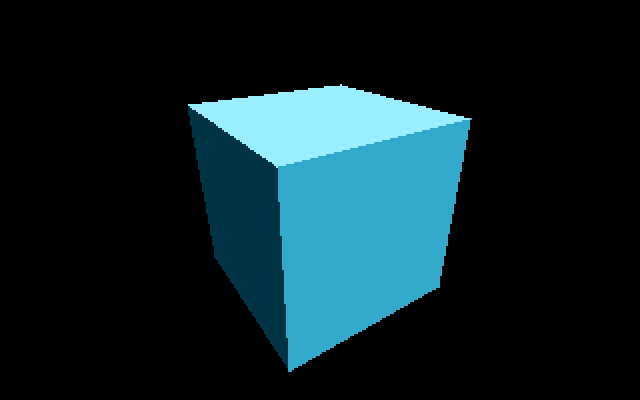
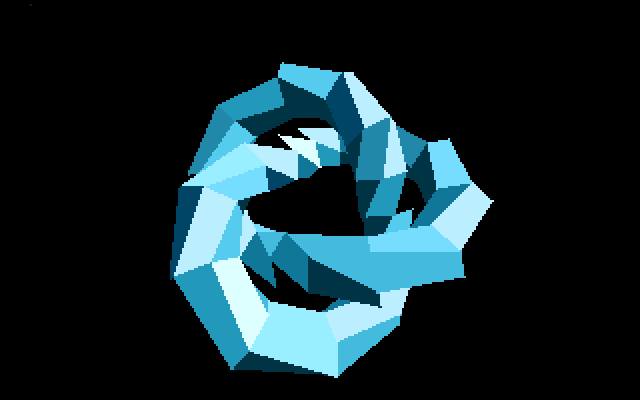

# Examples — Torus-Knot & Cube Renderers





Three flat-shaded 3D demos driving the SFP-004 FPU through the library's
fused-dispatch session layer: a rotating (2,3) trefoil torus knot rendered two
very different ways, and a classic spinning cube for benchmarking. Developed
and tuned on a Mega STE (16 MHz + cache, enabled automatically at startup)
with a 68882 on the motherboard.

| Demo       | Binary                      | What it is                                                                                                                                                                                                                                                                                                                    | Speed¹            | Speed²            |
| ---------- | --------------------------- | ----------------------------------------------------------------------------------------------------------------------------------------------------------------------------------------------------------------------------------------------------------------------------------------------------------------------------- | ----------------- | ----------------- |
| Raymarcher | `TORUS.TOS` / `TORUSHI.TOS` | Real-time SDF sphere tracing in chunky-sim blocks — the raw-compute flex; every pixel is honest ray-marched signed-distance-field work on the 68882 in fused CIR sessions                                                                                                                                                     | Seconds per frame | Minutes per frame |
| Cube       | `CUBEMESH.TOS`              | The traditional flat-shaded spinning cube on the same pipeline — minimum geometry (8 vertices, ~270 coprocessor dialogs a frame). A friendly benchmark for comparing STs of different specs: the transform counter shows what the FPU buys, the rest shows CPU/bus speed, and the same binary runs (soft-float) on a stock ST | ~50 fps           | ~10 fps           |
| Mesh       | `KNOTMESH.TOS`              | The same knot as a low-poly faceted mesh (Three.js `TorusKnotGeometry`-style, 26×6 segments): the 68882 runs the vertex rotate/project pipeline in fused sessions; the 68000 does the integer backface cull, depth-bucket painter's sort, fixed-point lighting, and span fills at full 320×200                                | ~6 fps            | ~1 fps            |

¹ 16 MHz Mega STE with cache and a 68882.
² Stock 8 MHz ST with soft-float no cache.

## Building

With the m68k-atari-mint toolchain on your PATH:

```bash
make -C examples
```

or with [atarist-toolkit-docker](https://github.com/sidecartridge/atarist-toolkit-docker),
from the repository root:

```bash
STCMD_NO_TTY=1 stcmd make -C examples
```

| Target       | Renderer   | Resolution    | Binary         |
| ------------ | ---------- | ------------- | -------------- |
| `make lores` | raymarcher | 80×50 @ 4×4   | `TORUS.TOS`    |
| `make hires` | raymarcher | 160×100 @ 2×2 | `TORUSHI.TOS`  |
| `make mesh`  | polygons   | 320×200       | `KNOTMESH.TOS` |
| `make cube`  | polygons   | 320×200       | `CUBEMESH.TOS` |

Mesh density is tunable with `-DTSEG=.. -DRSEG=..` (default 26×6).

## Running

Copy the `.TOS` files to your ST (or an emulator disk image) and run from the
desktop. Press **ESC** to exit. White numbers top-left are frame timings in ms
from the 200 Hz system tick: total frame, then FPU transform phase, then paint
phase (mesh and cube demos). The mesh demos are double-buffered with the page
flip latched before the VBL wait, so what you see is always a complete frame.

Note: Hatari does not emulate memory-mapped FPUs, so under Hatari everything
runs on the soft-float fallback — correct but slow (use fast-forward).

## How the raymarcher works

- **Geometry**: (2,3) trefoil knot SDF — two strand circles per carrier-torus
  cross-section, the pair pattern turning 1.5× per revolution. No `atan2`:
  cos/sin of the half angle come from `sqrt((1±cosθ)/2)` with sin's sign, so
  the whole SDF is mul/sqrt — exactly what the 68882 dispatch provides
- **FPU**: ray setup, each march step, and per-pixel shading run as single
  fused coprocessor sessions (the session layer in `atari_sfp004.h`):
  operands load once, intermediates stay in FP0–FP7, only results cross the
  bus. Multiplies and divides use the 68882's fast single-precision
  FSGLMUL/FSGLDIV; the palette index comes back via FINTRZ + FMOVE.L
- **Culling**: analytic ray/bounding-sphere test kills background rays in one
  short session and gives survivors a tight march interval
- **Two-level marching**: the plain carrier-torus shell SDF (a valid,
  Lipschitz-1 lower bound at a third of the cost) drives the march until
  within `BOUND_NEAR` of the shell; only there is the knot field evaluated
- **Temporal reuse**: per-pixel warm-started march distances from the last
  frame, plus checkerboard rendering (alternate pixels held one frame)
- **Hot-loop compares**: float tests are integer compares on IEEE bit patterns

## How the mesh demo works

- **Mesh**: strand-centre curve of the same knot, tubed with TSEG×RSEG quads
  at startup; winding fixed so screen-space culling is a single cross product
- **FPU**: per-vertex rotate + perspective project + FINTRZ in one fused
  session per vertex (~36 dialogs); the x-row zero of Rx·Ry is exploited
- **Lighting**: light rotated into object space once per frame, then each
  face is three 68000 `muls` against 8.8 fixed-point normals — cheaper than
  any coprocessor session, and face normals never transform
- **Raster**: per-scanline DDA edges (not per-pixel Bresenham), spans filled
  as plane-pair long writes with table-driven edge masks, patterns hoisted
  per face; painter's order from 256 depth buckets (O(n), no sort)
- **Blitter**: hog-mode screen clear when present (`Blitmode()` detected)

## How the cube demo works

The same pipeline as the mesh demo, minus everything a convex solid doesn't
need: backface culling alone gives correct visibility, so there is no depth
sort and no per-vertex depth at all — 8 fused vertex transforms, six sign-only
axis normals for the integer lighting, and the span filler. What remains is
almost pure CPU/bus work, which is what makes it a good cross-machine
benchmark.

## Tuning

| Knob             | Where          | Effect                            |
| ---------------- | -------------- | --------------------------------- |
| `TSEG`, `RSEG`   | `knotmesh.c`   | Mesh density (facets vs speed)    |
| `TUBE_R`         | both           | Tube radius                       |
| `MAX_STEPS`      | `torus.c`      | March quality vs speed            |
| `SDF_SCALE`      | `torus.c`      | March safety factor (twist bound) |
| `CHECKERBOARD`   | `torus.c`      | Temporal half-resolution on/off   |
| `angle_y/x` step | `main()` loops | Rotation speed                    |
| `palette[]`      | both           | Colour scheme                     |
